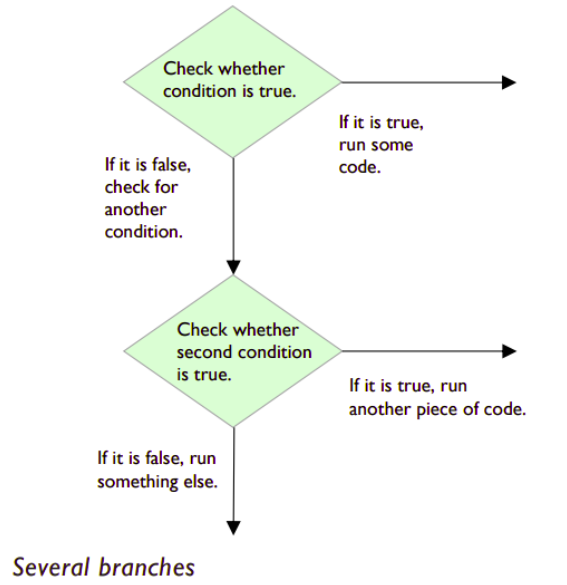

# elif 📚

## Several branches – using elif
When the condition is ``False``, we may need to test for some 
other conditions, in order to decide which clause to run next. In these situations, we use another conditional called the ``elif`` statement. This is short for *else-if*.



Sticking with our checkout example, we will now ask customers what type of payment they would like to make: 
cash, card or coupon.

## Task 3 👨‍💻

👉 Start a new script in `Thonny` by typing the following:
````py
payType = input("Do you want to pay using cash, card or coupon?")
````
👉 Add an ``if`` statement, using a Boolean expression to test for the first condition, just as before:
````py
if payType == "cash":
  print("Please insert cash.")
````
👉 After the ``if`` statement and lined up with ``if``, add your 
``elif`` statement, using a Boolean expression to test for the
next condition:
````py
elif payType == "card":
````

Remember to *indent* the next line and type:
````py
  print("Insert card into machine.")
````
💡 Make sure that you put the colons in the right places.

## Question to make you think... 🤔

What if the customer does not want to pay using cash or 
card? 

They must want to pay using a coupon as it is the only remaining option. 

👉 Type this else statement:
````py
else:
  print("Coupons are only accepted at Customer Service.") 
````

💡 Remember to indent on the line after ``else:``.

Your completed script should now look like this:
<details>
  <summary> Completed Program</summary>

  ````py
  payType = input("Do you want to pay using cash, card or coupon?")
if payType == "cash":
    print("Please insert cash.")
elif payType == "card":
    print("Insert card into machine.")
else:
    print("Coupons are only accepted at customer service.")
  ````
</details>


Here is the output, assuming the customer wants to pay 
using a card:
````
Do you want to pay using cash, card or 
coupon? card
Insert card into machine.
````

👉 Experiment with and *Modify* your code to test that different answers give the correct result.

## ✍ Reminder

An ``elif`` statement must always come after an ``if``statement and before an ``else`` statement (although the *else* is not always required, the *if* is).

As you can see, an ``elif`` statement allows your program to 
have many branches, allowing only one particular branch to 
be followed when a specific condition is met.
